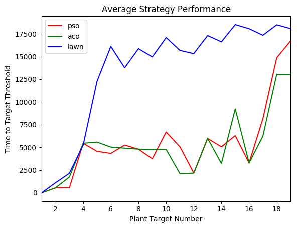
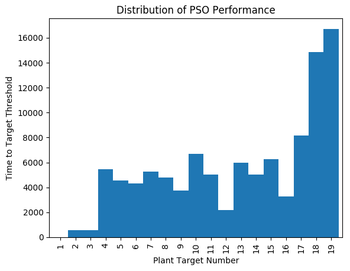
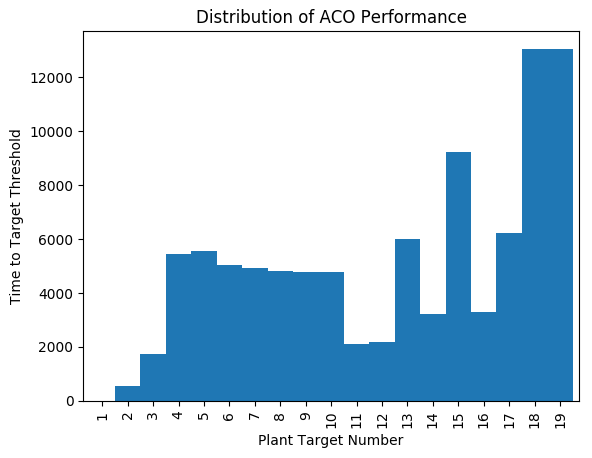
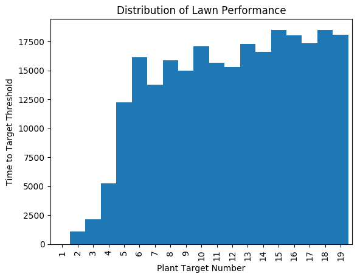
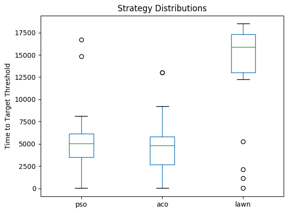
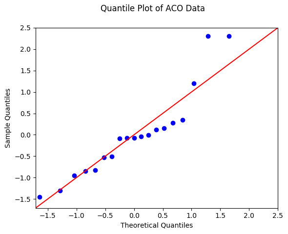
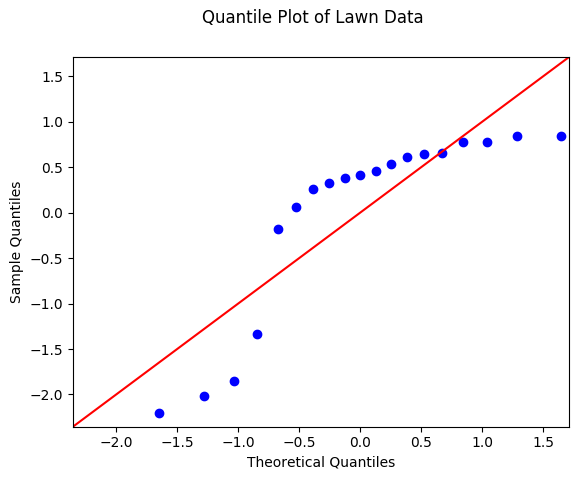
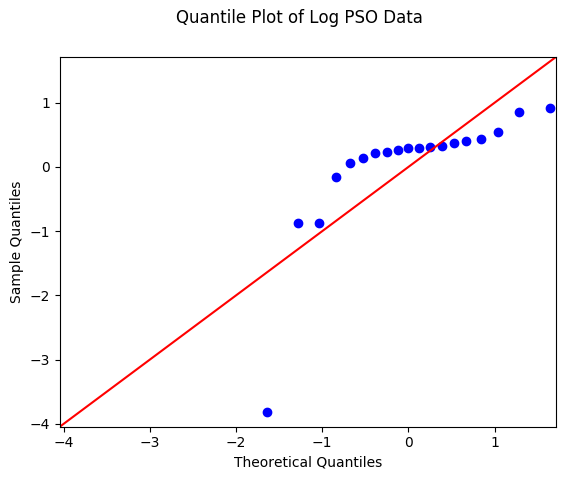
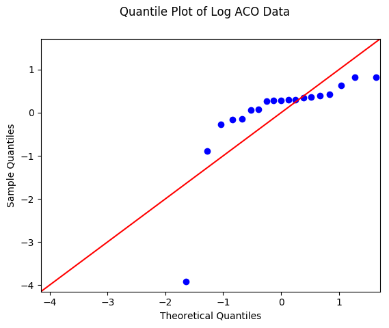

#  A Comparative Analysis of Multi-Robot System Strategies for the Automation of Green Wall Maintenance.

## Introduction
This project presents an analysis of two operational strategies of a UAV-based, Multi Robot System (**MRS**) tasked with performing the robotic maintenance of a Green Wall System (**GWS**) in simulation. The proposed robot collective is referred to as a Green Wall, Multi Robot System (**GREW-MRS**). Hypothesis testing is employed to comparatively evaluate swarm-inspired vs lawn-inspired approaches to Coverage Path Planning (**CPP**) and Cooperative Control (**CC**) in the proposed robot collective with a null hypothesis, H<sub>o</sub> (1) and alternate hypothesis, H<sub>a</sub> proposed as follows:

**Hypothesis (H<sub>o</sub>)**: The mean *time-to-target-threshold* in the Lawn strategy is **equal** to that of the Swarm-inspired strategy.

**Hypothesis (H<sub>a</sub>)**: The  mean *time-to-target-threshold* in the Lawn  strategy is **less than** that of the Swarm-inspired strategy.

More specifically, in the case of the the swarm-inspired strategy the CPP problem is formulated as a Travelling Salesman Problem (**TSP**) and is thereafter solved using the Particle Swarm Optimization (**PSO**) and Ant Colony Optimization (**ACO**) algorithms. Conversely, the lawn-inspired strategy utilizes naive sweeping motions to approximate optimal coverage. Each agent localizes, classifies and acts upon randomly distributed co-planar targets that are functionally symbolic of a vertical, plant-abundant wall planter. Global objectives are probabilistically respected by locally acting agents via limited sensing and communication techniques. Simulation and data pipelines are provided with a sample dataset included for research posterity.

## Requirements
This code has been tested on both Linux (Ubuntu 16.04) and Windows (via Windows Linux Subsystem). The latter requires an X-windows server installed on the windows host (e.g. [XMing](https://sourceforge.net/projects/xming/)).
This project has the following software dependancies:
- [CMake](https://cmake.org/)
- [Python](https://www.python.org/) (developed in Python3.5)
- [Argos3](http://argos-sim.info/)
- [xmlstarlet](http://xmlstar.sourceforge.net/)
- [python3-tk](https://packages.debian.org/jessie/python3-tk)
- [bc](https://www.gnu.org/software/bc/manual/html_mono/bc.html)
- [Pandoc](http://pandoc.org/)
- [SciPy](https://www.scipy.org/)
- [jupyter](https://jupyter.org/)
- [statsmodel](http://www.statsmodels.org/stable/index.html)

The provided ```run.sh``` script provides an install command ```./run.sh -I``` that installs and creates a packaged environment for this project.

## Dataset Generation

The run script (`run.sh`) in the source codes' root directory is the main entrypoint for this project. It has a number of options that can be dynamically set for a wide range of simulation scenarios. This are available for reference by passing the help flag as a parameter.


```python
./run.sh -h
./run.sh usage:
    -a  Select path planning algorithm/strategy (pso, aco or lawn).
    -b  Build the main argos project. Use after editing source files.
    -d  Set the number of drones to place in simulation.
    -e  Set experiment source file. Default: "main".
    I)  Create experiment environment and install package dependancies.
    -j  Run the jupyter environment.
    -m  Set hard-limit for simulation runtime. Default: 20,000
    -n  Set number of targets/plants to place in simulation.
    N)  Set value range of targets/plants to place in simulation.
    -s  Set the number of independantly seeded trials to run.
    -t  Set the target coverage/inspection percentage during trial.
    -v  Enable argos vizualization. Disabled by default for speed.
    h | *)  Print this usage info.
```

## Data Analysis

The sample dataset was created with the following settings:
- Target Coverage Percentage of 90%
- Across all three strategies (PSO, ACO and Lawn).
- Independantly seeding 5 iterations per target number trial.
- Across a range of 1 to 19 targets.

```python
./run.sh -t "0.90" -a "pso aco lawn" -s "5" -N "1 19"
```

We first convert the csv dataset into hdf5 format for data storage and loading efficiency, and compute our sample means as shown below:

```bash
               pso      aco     lawn
TargetNum                           
1              2.0      2.0      2.0
2            547.4    547.2   1108.0
3            548.6   1733.2   2144.4
4           5447.0   5447.0   5258.0
5           4559.4   5573.8  12269.0
6           4330.0   5025.6  16109.8
7           5249.6   4908.4  13759.0
8           4792.2   4798.0  15863.0
9           3745.4   4769.0  14957.2
10          6678.8   4761.8  17078.8
11          5054.0   2106.6  15673.0
12          2174.2   2168.4  15319.6
13          5976.8   5991.0  17299.4
14          5054.4   3224.6  16612.2
15          6288.8   9220.6  18502.0
16          3285.6   3285.8  18051.6
17          8141.4   6227.4  17336.2
18         14865.2  13041.2  18477.0
19         16711.4  13027.8  18062.8
```

We visualize the computed means to firstly attempt a determination of their distributions as shown in the figure below.

<p align="center">
    
</p>

We can also plot the strategy performances with bar charts to better infer their distributions as shown in the bar charts below. 

<p align="center">
    
    
    
</p>

As can be seen in the figure below, there is a marked variability in the mean performances of the strategies, but we also cannot precisely estimate the normality of the data. The boxplots visualised in the figure below serves to better illustrate how the data distributions compare to each other.

<p align="center">
    
</p>

To verify the normality requirement of parametric tests, we use Quantile-Quantile (Q-Q) plots to quickly identify the shape of our data distributions. In the Q-Q plots shown in figures below, the quantiles of our sample distributions are plotted against quantiles of a normal distribution as a scatter plot. It can be visually estimated that our data is normally distributed as the presented datasets generally follow their normality diagonals (in red).

<p align="center">
    
    
    
</p>

 We could additionally use Scipys' normaltest utility to determine this normality, noting that the kurtosis test is only valid for sample sizes greater than or equal to 20. The result of this test is shown below:
```
The results of the normality tests are: 
PSO: -> tc-value = 11.144 tp-value = 0.004 
ACO: -> tc-value = 5.515 tp-value = 0.063 
LAWN: -> tc-value = 6.670 tp-value = 0.036
```
Before we can evaluate the result of this normality test, we must define our significance level (alpha) that specifies the probability of rejecting the null hypothesis when it is actually true. In this experiment, we elect to set the significance level of the statistical test to 0.05 as is common in the literature. We can now evaluate the result of our algorithmic normality test which returned p-values lower than our alpha level (0.05), indicating a rejection of the null hypothesis that the distributions are normal. However, the sample dataset generated only has (**n=19**) and was surmised to have skewed our tepid normality results as evidenced in the api output. If normality was not proveable in the exact sense, we could perform log, square root, or inverse transformations on our original data which **may** have led to better approximations to the normal distribution. Q-Q log plots of our data can be seen in the figures below.

<p align="center">
    
    
    
</p>

We have proven normality and now must prove homoscedasticity which refers to the similarity of variances. A number of tests exist to perform this check, including:
- Bartlett’s Test (parametric)
- Levene’s Test (parametric)
- Fligner's Test (non-parametric)

They exhibit decreasing sensitivity to strong departures from normality with Fligner's being the most robust. We limit ourselves to these tests as they have implementations in the SciPy Python library. We take a middle-of-the-road approach and go for Levene's Test whose calculation gave the following result:
```
The results of the homoscedasticity tests are: 
PSO: -> tw-value = 0.063 tp-value = 0.803 
ACO: -> tw-value = 0.960 tp-value = 0.334 
LAWN: -> tw-value = 1.475 tp-value = 0.232
```
As can be seen in the above result, our homoscedasticity test p-values are higher than our alpha level (0.05) which means we have failed to reject the null hypothesis that the distributions exhibit equal variances. If homoscedasticity could not be determinably proven, we could elect to use Welsch's t-Test that works better with unequal sample variances. Alternatively, we could perform a variable transformation such as a Box-Cox transformation.

## Hypothesis Test

We can now perform our t-test, where sample independance is assured on
account of the simulation random-trialling mentioned previously. We
shall use the independent, two-sample t-test whose result is shown below:
```
The results of the independent t-tests are: 
PSO:ACO -> tt-value = 0.315 tp-value = 0.755 
PSO:LAWN -> tt-value = -4.577 tp-value = 0.000 
ACO:LAWN -> tt-value = -5.051 tp-value = 0.000
```
For completeness, we performed a t-test on our pso and aco samples and got a p-value of 0.755, indicating that there is no statistically significant difference between the two means. Central to this work, we have p-values of 0.000 for the pso-lawn and aco-lawn tests which is less than our alpha level of 0.05. This is an indication of statistically significant difference between their means. This means we can assuredly reject our null hypothesis in these scenarios.
